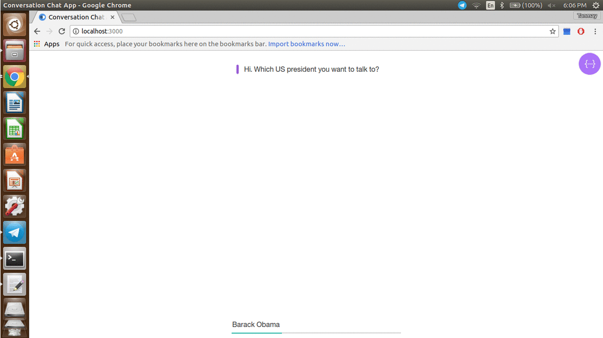

We are tried to implement a chat-bot which would simulate an historical figure such as any past US president. 

The idea is creating a chat-bot with an artificial character and personality starting from web pages or
plain text about a certain person.

Usage:
node server.js

Acknowledgements:
1. “Designing a Chat-bot that Simulates an Historical Figure”, Emanuela Haller; Traian Rebedea 2013, 19th International Conference on Control Systems and Computer Science
2. https://github.com/watson-developer-cloud/conversation-simple/
